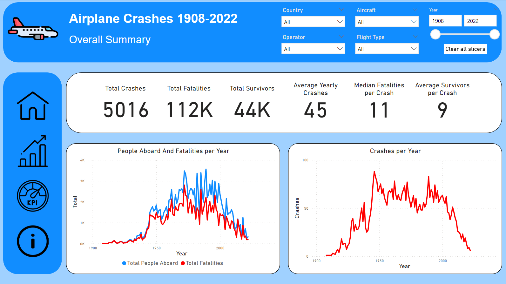
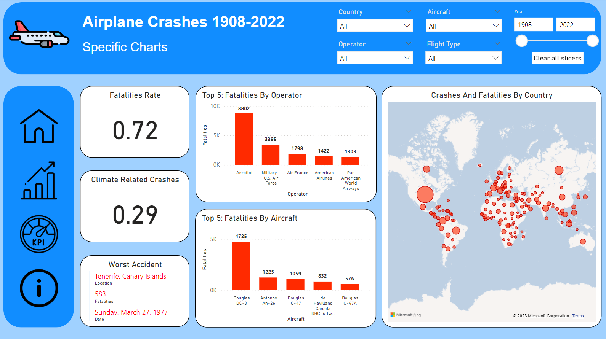
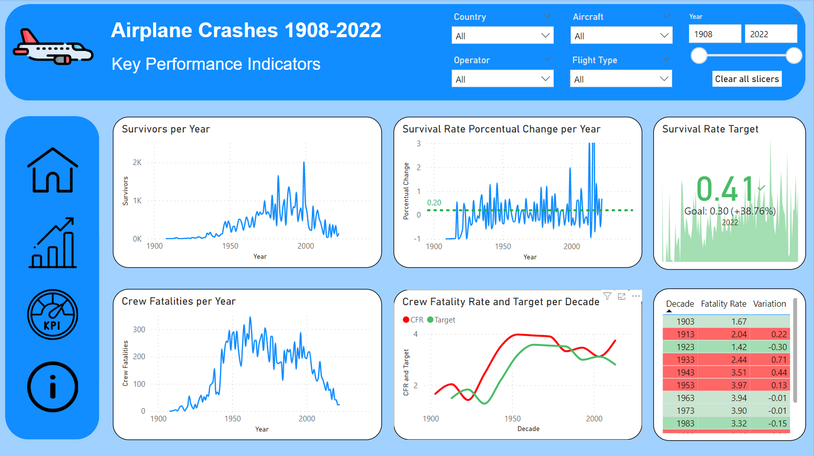

# <h1 align=center> **Individual Project DA** </h1>

# <h2> **Introduction and Objectives of the project** </h2>
This project is based in data about airplanes crashes arround the world from 1908 to 2021 that the Henry Team provided me, the original dataset contains 5008 rows and 18 columns, but, for this project, i'll use only 8 of the original columns and i'll add new rows with the accidents that ocurred after the 09/21/2021 and before 2023.

The objective is to analyse and comprehend in depth the relationship between the number of accidents and fatalities and the variables, in order to identify possible improvements that could be implemented to reduce the number of accidents and fatalities.
It might also be interesting to identify what needs to be considered if you want to have the safest possible flight from a probabilistic perspective.

Once the data is fully understood and depured, i need to accompany the analysis with a dashborad with charts that explain the behaviour of the data in order to define KPIs that facilitate the alignment of our actions today with our goals in the future.

The dataset doesn't come with a dictionary, but I've made one for you.
Here are the columns from the original dataset that I've chosen for this project, what they mean and why I chose them:

- *Date* : Date of accident in the format YYYY-MM-DD (datetime) .
Key value to understand the evolution of the data over the years and how it behaves when you use a closed time period or filters like month or day.

- *Location* : City, Country or a description in case of an accident outside any country (object).
Important column for demographic analysis, specifically, for a demographic map.

- *Operator* : Airline (object).
It might be interesting to find patterns of which airlines have the most accidents or victims and the characterisctics of those.

- *Route* : Route of the flight before the crash or objetive in case of non comercial flights e.g. Training. (object)
This column could also show interesting patterns to explain the occurrence of accidents.

- *AC Type* : AirCraft type (object).
This column shows how the different aircrafts perform against accidents and could be an interesting parameter to elaborate metrics to reduce failures in them and produce aircrafts of better quality.

- *Aboard* : Amount of passengers and crew members abboard (float).
Key parameter for elaborating possible KPI's.

- *Fatalities* : Number of people who died in the accident (float).
This column is also a key parameter in the development of KPI's.

- *Fatalities* Crew : Number of crew members who died in the accident (float).
This column is required by the Henry team to create a specific metric called "Crew Fatality Rate".

The [ETL](https://github.com/motm-1/PI_DA/blob/main/transformations.ipynb) and [EDA](https://github.com/motm-1/PI_DA/blob/main/eda.ipynb) process was made in Python. The libraries utilized for this project are listed in the file [requeriments.txt](https://github.com/motm-1/PI_DA/blob/main/requeriments.txt).

# <h2> **Dashboard and KPI'S Explained** </h2>

After analysing the information in depth, the conclusions were reduced to a three-page dashboard:

On the first page, we can see the total number of flights and people affected in a given period of time.
The aim of this page is to understand where the root of the problem is and how it's affecting us today.
You can see that a large number of crashes are concentrated between the years 1940 (when commercial aviation started to become popular) and 2000, with a total of 3736 crashes, 76% of the total, taking place in 52% of the time that we have measured.
It means that the main problem we face today is not the number of accidents, maybe that's a problem of the past.
When I saw this, I started to investigate what problem we need to solve now and what indicators might be useful to define the steps we take to solve it, but before I show you the indicator I've chosen to measure our progress towards this goal, I want you to see the information I analysed to reach this conclusion.

On this page of the dashboard we have various graphs in which I have filtered the data by the main variables to see if there are any countries, operators or aircraft that can be useful in understanding the behaviour of fatalities and crashes.
What i've found is that:
- The fatality rate for a crash is 72%, which means that 7 out of 10 times that someone is present in a plane crash, their fate is to die there.
- The USA accumulates the highest number of fatalities and crashes, and is also the country with the highest number of crashes in military operations, Russia is the second country in this ranking.
- Aeroflot is the worst airline of the past century in terms of the number of fatalities, but there's no need to worry about it today has it has had only one crash since 1997.
- The aircraft with the highest number of fatalities by far is the Douglas DC-3, but I won't say it's a bad aircraft because it was one of the most popular and we don't have the total number of flights made with this aircraft, so we can't calculate the ratio of crashes to successful flights. Also, this aircraft was used for military operations all over the world, where conditions could be favourable for a crash.
- Another thing that caught my attention was that 29% of the accidents were related to climatic reasons such as storms, rain, tornadoes or fog, which could be a useful metric to define our goals, but the one I've chosen is the survival rate. The survival rate is the opposite of the fatality rate and is defined as the number of survivors over the number of people aboard in an aircraft crash.

I've chosen this metric because crashes and fatalities are on a clear downward trend, but the survival rate is not on the same path, so it's a good idea to look at this metric to improve flight safety.
The KPI i've proposed is:
Evaluate the 20% improvement in the survival rate in the last year compared to the previous year.
As you can see from the metrics, the goal was achieved in 2022 the but it's something that we need to pay close attention to because it can easily go up again.

This second KPI was suggested by the Henry team:
Evaluate the 10% reduction in the Fatality Crew Ratio over the last decade compared to the previous decade.
We can see from the graphs that only 3 out of 11 decades (not counting the first) have reached the target.

What this analysis shows is that the challenge for the next few years is to introduce new safety measures to improve the survival rate and at least maintain the current trend in the number of accidents.

# <h2> **Additional Information** </h2>

If you want to see the full analysis, you can visit the [EDA](https://github.com/motm-1/PI_DA/blob/main/eda.ipynb) archive, where I explain in detail the discoveries I've haad.
[Original Dataset](https://github.com/motm-1/PI_DA/blob/main/src/datasets/AccidentesAviones.csv)